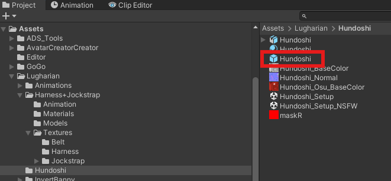

# ルーガン族アバターに対応済のパーツを追加する

このガイドでは、ルーガン族のアバタークリエイト機能に対応した衣装やパーツを追加する方法を詳しく解説します。

## 概要

ルーガン族アバターには`AvatarCreator`という独自のアバターカスタマイズ機能が搭載されています。この機能を使うと、ユーザーが自由にアバターの外見をUnity上でゲームのキャラクリエイト機能のように編集できるようになります。

## ベースオブジェクト

ルーガン族アバターのベースとなるプレハブは以下の場所にあります：

```
Assets/Lugharian/Prefabs/LugharianCreation.prefab
```

このプレハブには`Avatar Creator Setting`コンポーネントが付いており、アバタークリエイト機能の基本設定を管理しています。


## パーツオブジェクト

ルーガン族アバターのパーツは、`Avatar Creator Parts Setting`コンポーネントがついています。

これらのコンポーネントをベースのオブジェクト以下に配置することで機能します。

## パーツ追加の基本手順

ルーガン族アバタークリエイト機能に新しいパーツを追加するには、以下のステップで行います：

1. `LugharianCreation.prefab`をシーンに展開する
1. パーツオブジェクトを`LugharianCreation`以下に配置する

## パーツ追加の例

試しに褌衣装を追加してみましょう。

褌衣装のプレハブは以下にあります。

```
Assets/Lugharian/Hundoshi/Hundoshi.prefab
```



1. `LugharianCreation.prefab`をシーンに展開する
2. `Hundoshi.prefab`を`LugharianCreation`以下に配置する


3. 以下の画像のようになっていればOKです。


4. この状態で`Play`ボタンを押してシーンを再生するとパーツが追加された状態で編集ができます。

:::info

パーツが正しく表示されない場合は、以下の点を確認してください：

- パーツオブジェクトが`LugharianCration.prefab`以下に配置されているかどうか

:::
