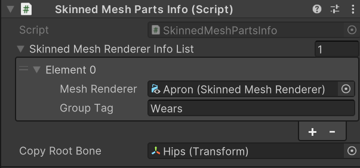
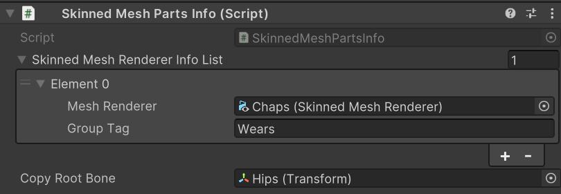
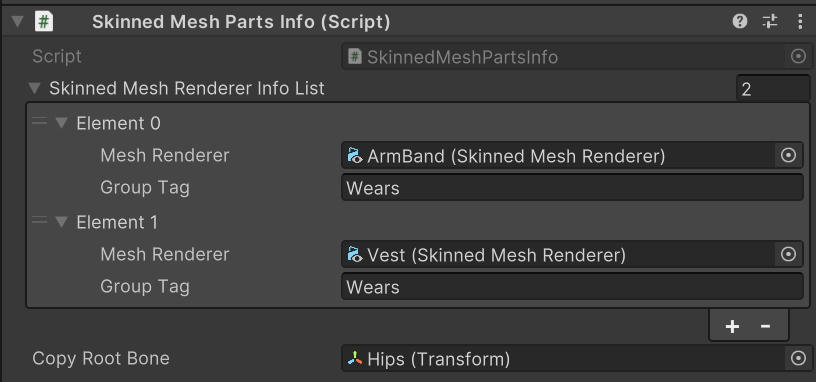

# よくある質問

## Expression Menuでの着せ替えに対応できませんか？

ルーガン族アバターのシステムは、Expression Menuでの着せ替えに以下の理由で対応していません。

- アバターパフォーマンスランクを最適化するため
- アバター容量を抑えるためになるべく服装毎のアバターを別でアップロードしてほしい
- 服の下のモデルを非表示するための機能の技術的問題のため

## 服のパーツがいくつか結合された状態で出力されるのを防ぎたい。

上記のExpression Menuでの着せ替えを自分で実装する場合に、いくつかのパーツがまとまって結合されてしまう問題があります。

この問題を解決するには以下の場所を変更することでパーツを分けることができます。

例：Wears

それぞれのパーツに`Skinned Mesh Parts Info`というコンポーネントがあり、`Group Tag`で同じ名前の物がある場合はそれぞれが結合されるようになっています。

例えば、`Apron`と`Vest_ArmBand`と`Chaps`は`Group Tag`が`Wears`になっており、結合されます。

それぞれの`Group Tag`を別の名前にすれば結合されることがなくなります。
