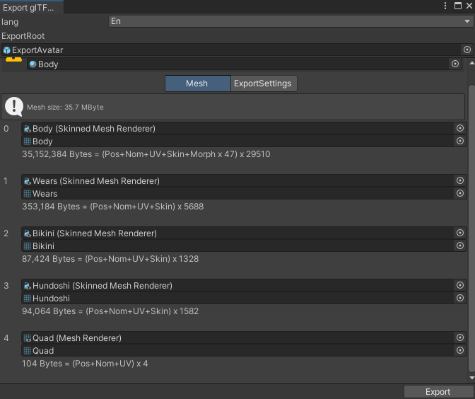
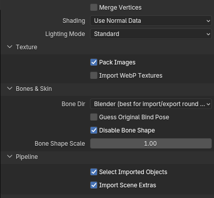

# よくある質問

## Expression Menuでの着せ替えに対応できませんか？

ルーガン族アバターのシステムは、Expression Menuでの着せ替えに以下の理由で対応していません。

- アバターパフォーマンスランクを最適化するため
- アバター容量を抑えるためになるべく服装毎のアバターを別でアップロードしてほしい
- 服の下のモデルを非表示するための機能の技術的問題のため

## 服のパーツがいくつか結合された状態で出力されるのを防ぎたい。

上記のExpression Menuでの着せ替えを自分で実装する場合に、いくつかのパーツがまとまって結合されてしまう問題があります。

この問題を解決するには以下の場所を変更することでパーツを分けることができます。

例：Wears


それぞれのパーツに`Skinned Mesh Parts Info`というコンポーネントがあり、`Group Tag`で同じ名前の物がある場合はそれぞれが結合されるようになっています。

例えば、`Apron`と`Vest_ArmBand`と`Chaps`は`Group Tag`が`Wears`になっており、結合されます。


それぞれの`Group Tag`を別の名前にすれば結合されることがなくなります。

## Blenderファイルで衣装改変等をするときに体格を合わせたい

付属のBlenderファイルで衣装などを追加するときに、変更後の体格に合わせたい場合、`BodyBase`オブジェクトのシェイプキー(`defShape.Belly`など)を変更することで体格を変更できます。


:::info

ルーガン族ではBodyBaseの体格変更シェイプキーのみ操作できるようになっていて、それ以外の同名のシェイプキーはBlenderのドライバー機能を使ってBodyBaseのシェイプキーと同じになるようにしています。

:::

## Exportしたアバターをモデルファイル(GLB)として書き出す。

エクスポートしたアバターをResoniteやBlenderなどの他ソフトにインポートできるように書き出すには、glTFファイル形式（.glb）で書き出すことができます。

まずUnityからGLTFをエクスポートするためのパッケージをプロジェクトに追加します。

ツールバーから`Window` > `Package Manager`を開きます。


`+`ボタンを押して`Add package from git URL`を選択します。


以下のURLを入力して追加します。

```
https://github.com/vrm-c/UniVRM.git?path=/Assets/UniGLTF
```

ツールバーに`UniGLTF`という項目が追加されていれば導入成功です。

使い方は`UniGLTF`から`Export glTF...`を選択します。


`Export Root`にエクスポートしたいアバターを設定します。



特に設定は変更せずに`Export`を押せばファイルとして保存出来ます。

Blenderにインポートする場合は、`File` > `Import` > `glTF 2.0 (.glb/gltf)`を選択します。

インポート設定は以下の状態で読み込みます。



