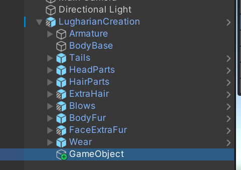
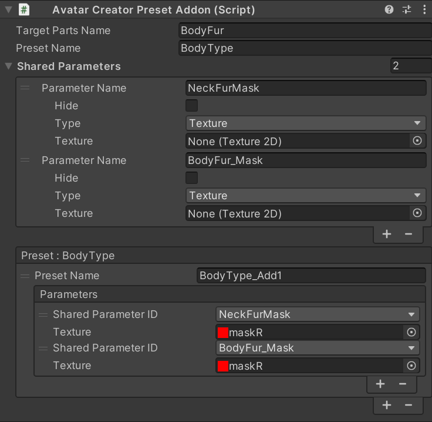

# プリセットアドオンを作成する

## 概要

プリセットアドオンは、`Avatar Creator Setting`や、`Avatar Creator Parts Setting`で設定されたプリセットに対して項目を追加できるアドオンを作ることができる機能です。

カラー変更に対応したリテクスチャを作成したいときなどに使えます。

## 使い方

ルーガン族に新たなBodyTypeを後から追加する例で説明します。

まず、新しいゲームオブジェクトを作成します。

次にそのゲームオブジェクトに`Avatar Creator Preset Addon`を追加します。

`Target Parts Name`には結合したいプリセットパラメーターがあるパーツの名前を設定します。ベースの場合は空欄でもOKです。

今回はベースの`BodyType`に新たなプリセットを追加したいのでそのままにします。

`Preset Name`は追加対象のプリセット名です。`BodyType`と入力します。

次に、プリセットで変更する共有パラメーターを追加します。
`Shared Parameters`でプラスボタンを押して、`LugharianCreation`で設定されているプリセットと同じように`BodyBase_MaskTex`パラメーターを追加し、`Type`を`Texture`にします。

`LugharianCreation`に設定されている`BodyType`プリセットの項目

`Shared Parameters`に`BodyBase_MaskTex`を追加して`Type`を`Texture`にする

そうしたら、`Preset`の項目からプラスボタンを押して新しいプリセットを作成し、`Preset Name`を`BodyType_new`等にします。

:::info

この時プリセット名はユニークになるように気を付けてください。同じ名前のプリセットの場合は反映されません。

:::

`Parameters`のリストでプラスボタンを押して、`Shared Parameter ID`を先ほど設定した`BodyBase_MaskTex`に変更し、`Texture`に新たなマスクを設定します。

このゲームオブジェクトを一度`LugharianCreation`(`AvatarCreatorSetting`がアタッチされたオブジェクト)のヒエラルキー以下に配置します。

この状態でいったん再生してみましょう。

`BodyType`に`BodyType_new`が追加され、選択すると変更されます。

`BodyType`は他のパーツオブジェクトでも使っているのでそちらも設定します。

該当するのは`HeadParts`、`BodyFur`、`FaceExtraFur`です。

新たにゲームオブジェクトを作成し、先ほどのアドオンオブジェクト以下に配置しましょう。場所はどこでもいいですが、同じプリセットパラメーターの物なら親子関係にすると後々プレハブ化するときに便利です。名前も適切なものを付けると良いでしょう。

新たに追加した`HeadParts_BodyType_Addon`に以下の設定をします。`Target Parts Name`が変わり、変更対象の`Shared Parameters`も変わります。

同様に`BodyFur`と`FaceExtraFur`も変更します。

`BodyFur`の設定

`FaceExtraFur`の設定

最終的にこのような形になっていればOKです。

再度実行してみるとこのようになります。

`BodyType`を後から追加することができました。

