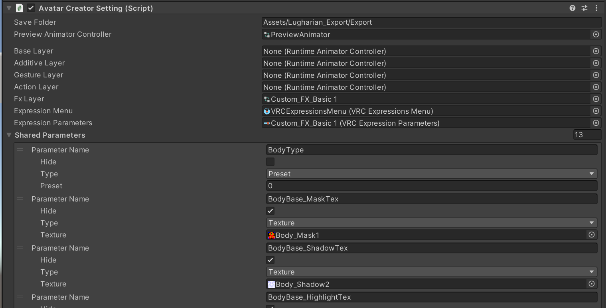

# アバタークリエイト機能について

ここではルーガン族アバターで採用されている、`Avatar Creator`システムについて解説します。

## 概要

`AvatarCreator`はUnityエディタ上でVRChat用のアバターをゲームのキャラクリエイト機能のような感覚で組み立てる機能を自分のアバターに対して実装することができる機能です。

`AvatarCreator`は以下のアバター編集機能を備えます

- 部位に応じた色変更機能 (Custom Layered Texture)
- 服などのパーツ表示に連動した肌などのメッシュ非表示機能 (Layered Alpha Texture)
- BlendShapeの調整と書き出し時のベイク機能
- シェーダーパラメーターの動的変更
- AnimationClipによる詳細なパラメータ制御
- 設定のプリセット化
- エクスポート時のオブジェクト結合・最適化

`AvatarCreator`には`AvatarCreatorSetting`というコンポーネントと`AvatarCreatorPartsSetting`というコンポーネントの２種類のコンポーネントがあり、それぞれ以下のような役割を持ちます。

- **AvatarCreatorSetting**: アバターのベース設定を定義するコンポーネントです。アバターのルートオブジェクトにアタッチします。

- **AvatarCreatorPartsSetting**: `AvatarCreatorSetting`が適用されたアバターの子オブジェクトにアタッチし、追加のパーツ（衣装、アクセサリーなど）に関する設定を定義するコンポーネントです。

`AvatarCreatorSetting`が設定されたアバターがシーンに存在し、Unityの再生モードを開始すると、`AvatarCreatorSetting`は自身および子オブジェクトにアタッチされた`AvatarCreatorPartsSetting`を収集し、それらの設定に基づいてキャラクリエイト機能を構築します。この構造により、ベースアバターの設定を直接編集することなく、アドオン形式で衣装やパーツのカスタマイズ項目を追加できます。

## Skinned Mesh Renderer Combine Info

`Skinned Mesh Renderer Comobine Info`はいくつかのメッシュを`Group Tag`に合わせて出力時に結合する機能です。
`Avatar Creator Setting`では`Skinned Mesh Renderer Comobine Info List`にメッシュを登録することでこの後の設定項目でスキンドメッシュとマテリアルが認識されます。

`Avatar Creator Parts Setting`では`Skinned Mesh Parts Info List`に`Skinned Mesh Parts Info`というコンポーネントを設定することでメッシュを登録します。
`Skinned Mesh Parts Info`では`Copy Root Bone`にベースにおけるルートボーンに当たるオブジェクトを設定します。

`GroupTag`は何も指定しない場合はスキンドメッシュは`Body`という名前のオブジェクトで１メッシュとしてまとめられます。
それ以外の場合、同じ名前のオブジェクトで結合されます。

## 共通パラメータ（Shared Parameter）

共通パラメータは、キャラクリエイト機能でユーザーが変更可能なパラメータを表します。

以下のタイプが存在します。

- **Float**: 0から1の範囲の数値。ブレンドシェイプのウェイトやシェーダーの数値パラメータなどに使用します。
- **Color**: 色情報。マテリアルの色などに使用します。
- **Texture**: テクスチャアセット。マテリアルのテクスチャスロットなどに使用します。
- **GameObjectToggle**: ゲームオブジェクトの表示・非表示を切り替えます。
- **Preset**: 後述するプリセット機能のためのパラメータです。

`AvatarCreatorPartsSetting`で定義されたSharedParameterは、`AvatarCreatorSetting`（ベース設定）に同名かつ同タイプのSharedParameterが存在する場合、`AvatarCreatorSetting`のものが優先的に使用されます（実質的にベース設定のパラメータを参照する形になります）。`AvatarCreatorSetting`に存在しないパラメータのみ、`AvatarCreatorPartsSetting`独自のものとして扱われます。パーツ間で直接パラメータが統合・競合解決されることはありません。

|項目|説明|
|---|---|
|Parameter Name|パラメータ名|
|Hide|ユーザーからは非表示にするか|
|Type|パラメータータイプ|
|Value|パラメータータイプに応じた初期値|

## Layered Alpha Texture

Layered Alpha Textureは、特定のパーツ（服など）が表示される際に、その内側にあるメッシュ（肌など）を非表示にするためのアルファマスクを動的に生成する機能です。

`GameObjectToggle`タイプの共通パラメータに連動し、対応するパーツが表示状態のときに、指定されたアルファテクスチャを合成していきます。例えば、複数の衣装パーツがあり、それぞれが肌を隠すためのアルファマスクを持つ場合、現在表示されている衣装パーツに対応するアルファマスクのみが合成された最終的なアルファマスクテクスチャが生成されます。
この生成されたLayered Alpha Textureは、Custom Layered TextureのAlpha Maskスロットに設定することで、メッシュの貫通を防ぐ効果が得られます。

|項目|説明|
|---|---|
|Combined Texture ID|結合される対象とアルファテクスチャ。共通パラメーターから選択されます|
|Toggle Object ID|ここで設定された`GameObjectToggle`パラメータが有効な時に合成されます|
|Source Texture ID|結合するマスクテクスチャ。共有パラメーターから選択されます|

## Custom Layered Texture
Custom Layered Textureは、テクスチャの部分的な色変えを実現する機能です。シェーダーの機能に依存せず、実行時にカラー画像を直接生成するため、様々なシェーダーと組み合わせて使用できます。

処理の概要は以下の通りです。
1.  **BaseColor**: 基本となる色を設定します。
2.  **MaskTexture適用**: MaskテクスチャのR, G, B各チャンネルに対応する領域に、それぞれ指定された色（MainColor, SubColor, AccentColor）を重ねます。
3.  **ShadowTexture合成**: Shadowテクスチャを合成します。
4.  **HighlightTexture合成**: HighlightテクスチャをScreenなどの方法で合成します。
5.  **DetailTexture合成**: Detailテクスチャを乗算などの方法で合成します。
6.  **AlphaMaskTexture適用**: (オプション) Layered Alpha Texture機能で生成されたアルファマスクを適用します。

### ShadowTextureの合成手法
シャドウはシャドウテクスチャの値に応じてHSV値の明度を50%減少させるという特殊な処理になっています。
この合成方法を使用することで、色の統一感を保ちつつ自然な陰影がシャドウマスクのみでできる仕組みになっています。

### 陰影ブレンド機能

`Shadow Texture`と`Highlight Texture`のみ`Blend Param`を使用してRチャンネルとGチャンネル間を線形補間した合成値を扱うことができます。この機能は体型変化による陰影やハイライトの変化を想定したものです。

生成されたCustom Layered Textureは、任意のマテリアルの任意のテクスチャスロットに設定できます。これにより、体色や服の一部分だけの色変更などを柔軟に実現できます。

|項目|説明|
|---|---|
|Texture Name|この`Custom Layered Texture`の名前(パーツ内で一意になるようにしてください。)|
|Layer Mask Tex Param|色分けのマスクテクスチャとして使用するテクスチャ|
|Shadow Tex Param|陰影用の合成テクスチャ|
|Highlight Tex Param|ハイライト用のスクリーン合成テクスチャ|
|Detail Tex Param|色分けマスクによる影響を受けないアルファ合成テクスチャ|
|Alpha Mask TexParam|画像のアルファ値を決定するマスクテクスチャ。衣装などを着せたときに消える対象となる`Layerd Alpha Texture`を指定するのに使います|
|Base Color Param|色分けマスクで黒い部分に当たる色パラメータ|
|Main Color Param|色分けマスクでRチャンネルに当たる色パラメータ|
|Sub Color Param|色分けマスクでGチャンネルに当たる色パラメータ|
|Accent Color Param|色分けマスクでBチャンネルに当たる色パラメータ|
|Blend Param|陰影ブレンド機能のためのブレンド用Floatパラメータ|
|Is Standard Multipy|シャドウテクスチャの特殊な合成処理を使用せずに通常の乗算合成をする|
|Resolution|テクスチャ解像度(512,1024,2048の３種類)|

`Custom Layered Texture`は`Custom Layered Texture Slot List`で特定のマテリアルのテクスチャスロットに設定することができます

|項目|説明|
|---|---|
|Material|テクスチャを設定するマテリアル|
|Shader Parameter|テクスチャを設定するシェーダーパラメータ|
|Custom Texture|設定する`Custom Layered Texture`|

## Preset
プリセット機能は、複数の共通パラメータの状態を一つのセットとして保存し、一括で切り替えることができる機能です。
プリセットの切り替えは、`Preset`タイプの共通パラメータの値を変更することで行われます。例えば、ルーガン族ではBodyTypeのマスクを変更する為に使っています。

|項目|説明|
|---|---|
|Shared Preset Parameter ID|設定するプリセットパラメータ|
|Preset Name|プリセットの項目の名前|
|Shared Parameter ID|変更する共通パラメーター|

## Custom Shader Parameter
Custom Shader Parameterは、共通パラメータ（Float, Color, Textureタイプ）の値を、指定したマテリアルの特定のシェーダーパラメータにリアルタイムで適用する機能です。
これにより、シェーダーで公開されている様々な値をキャラクリエイト画面から動的に制御できます。

|項目|説明|
|---|---|
|Shader Parameter Name|変更するシェーダーパラメータ|
|Shared Parameter ID|共有パラメーター|
|Material ID|変更対象のマテリアルID|

## BlendShape Parameter
BlendShapeParameterは、共通パラメータ（Floatタイプ）によってブレンドシェイプのウェイトを制御する機能です。

AvatarCreatorでは、アバターの書き出し処理（メッシュ結合時など）において、特定の接頭辞を持つブレンドシェイプに対して特殊な処理を行います。
- **`defShape.`**: この接頭辞を持つブレンドシェイプは、書き出し時の設定値に基づいてメッシュに変形が焼き込まれ（ベイクされ）、書き出し後のメッシュからはブレンドシェイプ自体が削除されます。
- **`eyeDef.`**: 同様にメッシュに変形がベイクされ、ブレンドシェイプは削除されます。ただし、`eye.` `eye.l.` `eye.r.` といった接頭辞を持つ他の表情用ブレンドシェイプの変形結果に影響を与えないように、`eyeDef.`の変形が適用されます。これは、デフォルトの表情（例：半目など）を`eyeDef.`で作成しベイクした際に、他の表情ブレンドシェイプ（例：笑顔、怒り顔）が破綻しないようにするための仕組みです。
- **`eye.` `eye.l.` `eye.r.`**: これらの接頭辞は、メッシュ書き出し時にブレンドシェイプ名から削除されます。

これらのブレンドシェイプに関する処理は、主にアバターのエクスポート時に行われるメッシュ結合処理の仕様に基づいています。

|項目|説明|
|---|---|
|Shared Parameter ID|共有パラメーター|
|Skinned Mesh ID|シェイプキーがあるスキンドメッシュ|
|Blend Shape ID|変更すブレンドシェイプ|

## Animation Clip Parameter
AnimationClipParameterは、共通パラメータ（Floatタイプ）の値をアニメーションクリップの再生時間にマッピングし、その時点でのアニメーション結果をアバターに適用する機能です。
AnimationClipを使用することで、CustomShaderParameterやBlendShapeParameterでは設定できないような、より複雑で非線形な変化（オブジェクトのトランスフォーム変更、コンポーネントのプロパティ変更など）を実現できます。共通パラメータのFloat値（0～1）が、AnimationClipの正規化された時間（0～1）に対応します。

|項目|説明|
|---|---|
|Shared Parameter ID|共有パラメーター|
|Root Object|アニメーションのルート階層オブジェクト|
|Clip|アニメーションクリップ|
