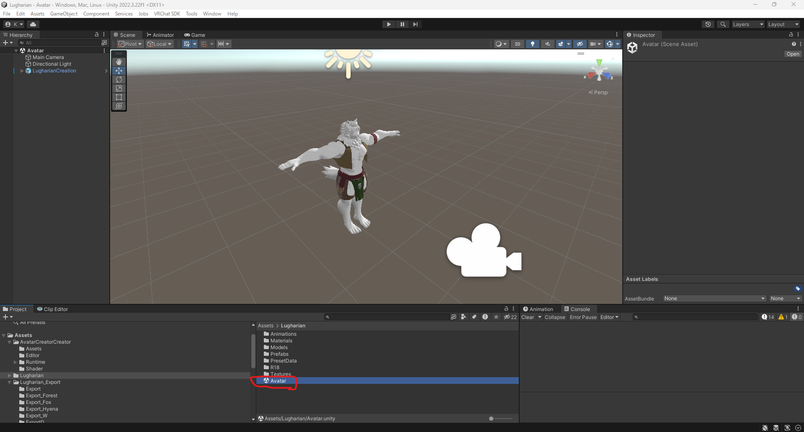
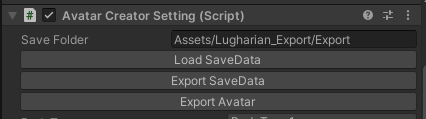
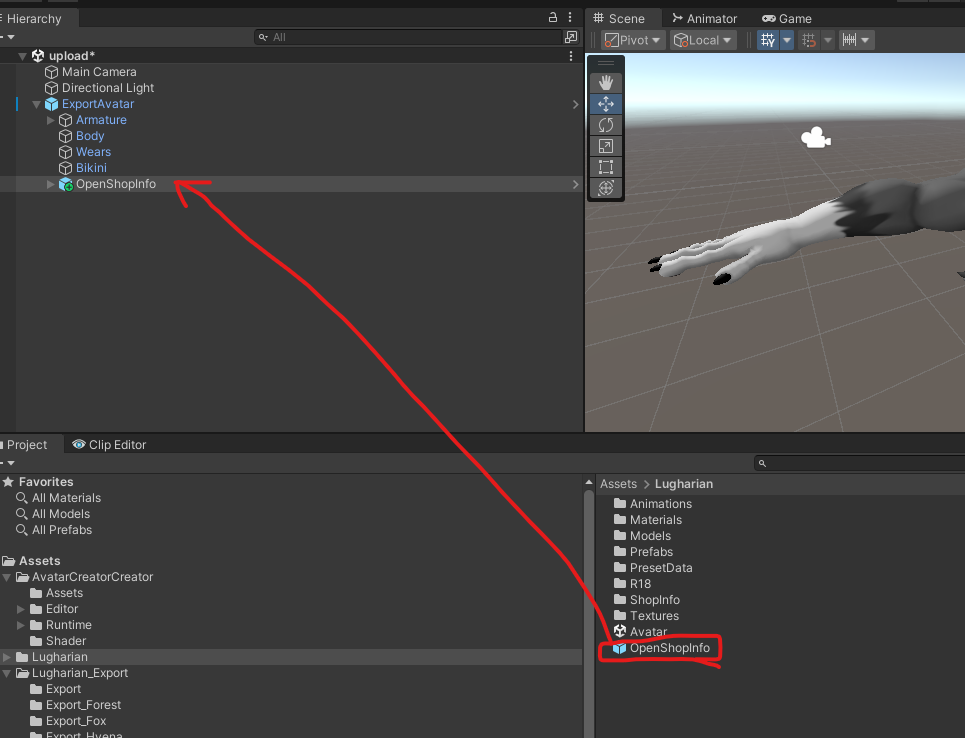

# 使い方

import useDocusaurusContext from '@docusaurus/useDocusaurusContext';

export const VersionInfo = () => {
  const {siteConfig} = useDocusaurusContext();
  return {siteConfig.customFields.version};
};

VCCを使用してアバター用のUnityプロジェクトの作成まで完了している想定です。

## 動画チュートリアル v1.5以前

**v1.6より開くシーンが変わっています。ご注意ください。**

`Avatar` -> `Lugharian_WolfBase_Setup`または`Lugharian_BigCatBase_Setup`など。

<iframe 
  width="560" 
  height="315" 
  src="https://www.youtube.com/embed/d0EHjJmXfDI" 
  title="YouTube video player" 
  frameborder="0" 
  allow="accelerometer; autoplay; clipboard-write; encrypted-media; gyroscope; picture-in-picture" 
  allowfullscreen
></iframe>

## lilToonシェーダーのインポート

[lilToon](https://lilxyzw.github.io/lilToon/)

上記のサイトを参考にlilToonをプロジェクトにインポートします。

## Modular Avatarの導入

[Modular Avatar](https://modular-avatar.nadena.dev/)

上記のサイトを参考にModularAvatarをインポートします。

## 本パッケージのインポート

Lugharian_v<VersionInfo />.unitypackageをUnityにドラッグアンドドロップでインポートします。

## アバタークリエイト機能を起動する

Lugharianフォルダ以下の~~Avatarシーン~~ v1.6以降は`Lugharian_[任意のベース名]_Setup`シーンを開きます。

シーンが開いたらPlayボタンを押します。

シーンが実行されるとゲームビューが切り替わり、アバタークリエイトシステムが起動します。

## キャラクターをカスタマイズする

起動すると以下のような画面になります。ゲームビュー内の`Select Creator`ボタンを押すと、キャラクターのパラメーターが表示されます。

:::info

`Select Creator`が表示されない場合
GameViewのこのスライダーを1倍にしてください。

:::

## 項目の説明

|項目名|説明|
|---|---|
|Save Folder|カスタムしたアバターの保存先フォルダ。「Assets」から始まるパスで指定してください。存在しないフォルダーは自動で作成されます。|
|Load SaveData|アバターの編集情報をファイルからロードします。|
|Export SaveData|アバターの編集情報をファイルにエクスポートします。|
|Export Avatar|現在の設定でアバターをエクスポートします。|

### それ以下の項目

以下の項目はアバターのカスタマイズパラメータです。スライダーやカラーを選択して自分好みにカスタマイズしましょう。

## 出力されたアバターをアップロードする
`Export Avatar`ボタンを押すと、指定されたフォルダに`ExportAvatar`というプレハブが生成されます。

**新しいシーン**を作成し、`ExportAvatar`をシーンに配置します。

:::info

Avatarシーンで操作すると不具合が発生することがあるため別のシーンでアップロードがおすすめです。

:::

新しいシーンは、`File`>`New Scene`で作成できます。

テンプレートは`Basic(Built-in)`を選択し`Create`を押します。

シーンにアバターを配置して、いつもの手順でアップロードできます。

:::tip

アバターをエクスポートするとエクスポートした先のフォルダに`save.json`が作られ、次にクリエイト機能を実行したときに`Load SaveData`で前回の編集内容を復元できます。

:::

## アバターをPublic化したいときは？

本アバターは以下の条件でVRChatにアップロードしたアバターをPublic化できます。

- 同梱されているショップ情報ギミックを追加する
- Public化するアバターのBlueprintIDを作者（@kurotori4423）に連絡する。

ショップ情報ギミックは`Lugharian`フォルダ以下の`OpenShopInfo`というプレハブがあるのでこちらをアップロードするアバターに追加します。

