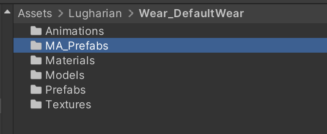
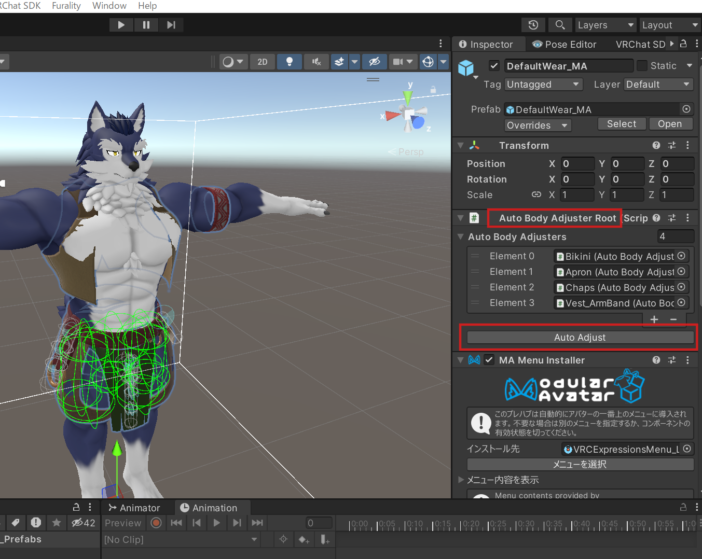
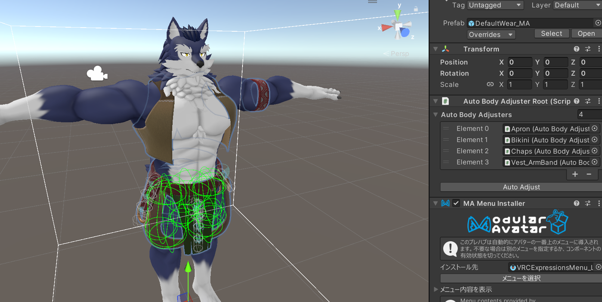

# 【中級者向け】Modular Avatarでの衣装・アクセサリセットアップ

この解説はアバタークリエイト機能を超えて、テクスチャの改変や、オンオフ機能を実装したい、アバター改変中級者以上向けのドキュメントです。

`v1.7`より [Modular Avatar](https://modular-avatar.nadena.dev/) による非破壊での衣装とアクセサリの追加に対応しました。すでにエクスポート済のルーガン族素体に対して、さらなるテクスチャ改変などを施していた場合でも、後から衣装を追加したり変更できるようになりました。

また、メニューへの自動追加機能が含まれ、衣装のオンオフや調整をExpressionメニューでゲーム内で切り替えることも可能になりました。

## Modular Avatar対応素体をつくる

以下のステップで Modular Avatar用の専用素体を作ります。この素体は一度作った後、独自テクスチャやマテリアルをあてても、今後登場する衣装を自由に変えることができます。

`Assets/Lugharian/`以下の`Lugharian_○○Base_Naked_Setup`を開きます。

シーンを再生し、アバタークリエイトに入ります。

`Advanced Settings`から

- Combined Mesh
- Active Alpha Mask

を両方ともオフにします。

オフにしたらベースとなるキャラクターを作成し、`Export Avatar`でアバターをエクスポートします。

エクスポートしたアバターを適当なシーンを作成して配置します。

この素体をベースに独自のテクスチャやマテリアルを設定できます。

## 作った素体に衣装を着せる

ここで作った素体に衣装を着せるには、各衣装フォルダに含まれている`MA_Prefabs`というフォルダ内のプレハブをシーンに配置します。

例えば`Assets/Lugharian/Wear_DefaultWear`の場合は、MA_Prefabs内の`DefaultWear_MA`をシーンのアバターのヒエラルキー以下に追加します。

衣装が体格にあっていない場合は、衣装プレハブの`Auto Body Adjuster Root`または`Auto Body Adjuster`コンポーネントを見つけて、`Auto Adjust`を実行します。

実行すると自動的に体系に合わせて衣装のブレンドシェイプが調整されます。

これで衣装付けは成功で、そのままアップロードできます。

## NSFWパーツでの注意点

NSFWパーツセットを使用した素体を作る場合は注意が必要です。

詳しくは[NSFWパーツセット解説](parts/nsfw_partsset.md#ma対応素体を作る際の注意点v17以降)をお読みください。

## v1.7以前に出力したアバタープレハブに対して、素体化する。

v1.7以前に出力されたアバタープレハブに関して、上記の書き出しオプションを守っている場合は以下の追加の作業で`Auto Body Adjuster`に対応することができます。

プレハブのルートオブジェクトに対して`BodyInfo`というコンポーネントをつけます。このコンポーネントはルーガン族アバターの体格情報を保持させるコンポーネントで、このコンポーネントの`Body Parameter Json`に書き出したときに生成された`save.json`を設定するだけで、`Auto Body Adjuster`による自動体格合わせを行うことができます。

## 標準MAプレハブ解説

### Lugharian/Base/MA_Prefabs/MA_BodyFur

体の各部位の毛のオンオフを行うメニューを追加します。
