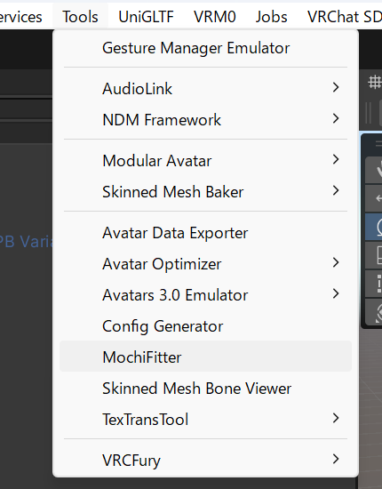
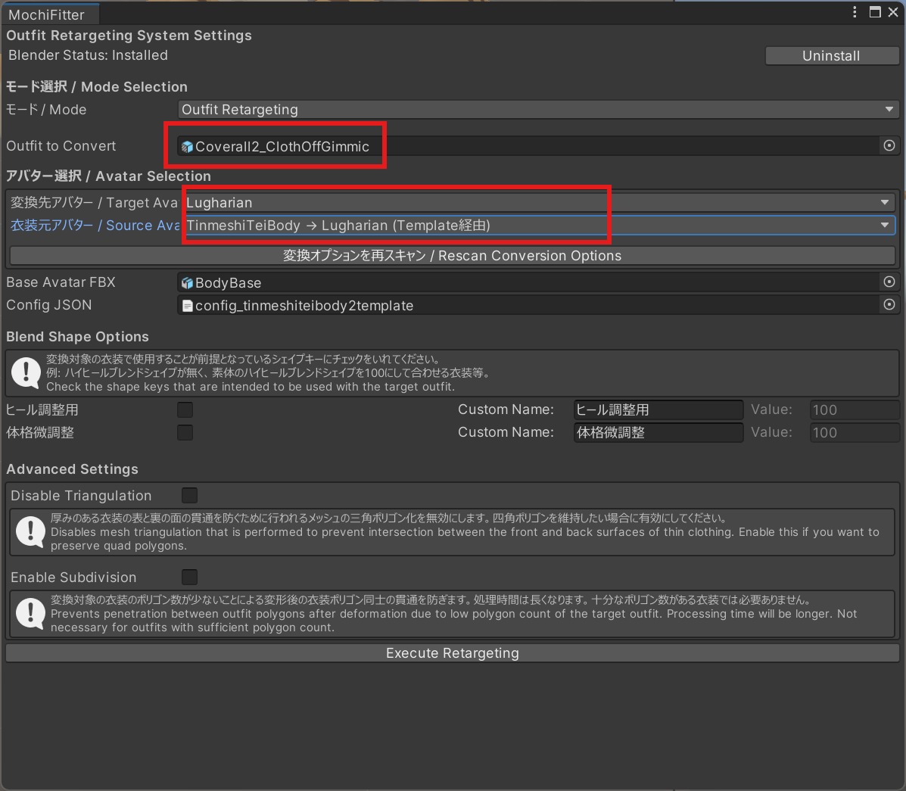
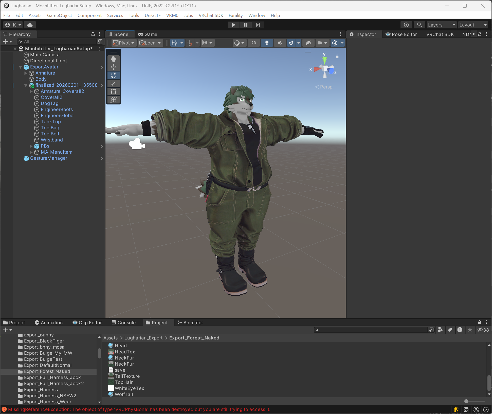

# もちふぃった～による非対応衣装の設定

ルーガン族用もちふぃった～プロファイルを使用することで、[もちふぃった～](https://yamirin.booth.pm/items/7657840)で非対応衣装（その衣装用の逆変換プロファイルがあることが前提）をルーガン族に着せることが可能です。

## 注意点

v0.2で以下の問題はおおよそ解決されました。

現在(v0.1)のプロファイルには以下の既知の問題があります。

- 肩回り、胸周りのメッシュが貫通しやすいです。
- 手袋などがうまく変換されません。

これがルーガン族アバター由来の問題なのか、もちふぃった～特有の問題かまだ判別できていないため、完璧な変換はできていません。ざっくりとした変換であると思ってください。

## 使用方法

詳細な使い方はもちふぃった～のドキュメントを参照してください。

### 1. 各パッケージの導入

- ルーガン族本体
- もちふぃった～
- ルーガン族もちふぃった～プロファイル
- 着せたい衣装パッケージ
- 着せたい衣装のもちふぃった～逆方向プロファイル

をインポートします。

### 2. 衣装の変換

ここでは、[珍飯亭共通素体『エンジニアツナギ』](https://booth.pm/ja/items/6030643)を例に変換の流れを説明します。こちらの逆変換プロファイルは[こちら](https://booth.pm/ja/items/7664825)から入手できます。

また追加で

- [Modular Avatar](https://modular-avatar.nadena.dev/)
- [AAO: Avatar Optimizer](https://vpm.anatawa12.com/avatar-optimizer/)

も`VCC`や`ALCOM`で事前にプロジェクトにインポートしてください。

ツールバーから`Tools` > `Mochifitter`を選択して、`MochiFitter`ウィンドウを開きます。

**初回は、Blenderとアドオンのインストールが促されます。インストールを行ってください。**

インストールが完了したら、`Outfit to Convert`に変換したい衣装を設定します。今回は`Assets/TinmeshiTei/Cloths/Coverall2/Prefab/Coverall2_ClothOffGimmic.prefab`を設定しました。

- `変換先アバター / Target Avatar` に `Lugharian`
- `衣装元アバター / Source Avatar` に `TinmeshiTeiBody`

を選択します。`衣装元アバター / Source Avatar`は変換したい衣装元のアバターによって変わります。

それ以外は変更せずに、`Execute Retargeting`を実行します。

暫くすると衣装の変換が完了します。

### 3. 衣装を着せる

まず、着せたいルーガン族の`ExportAvatar`プレハブをシーンに配置します。服を着せていない状態のルーガン族を事前に作成しておくと良いです。

### v0.2での追加設定事項

v0.2で生成動作が変わりました。v0.2で変換した衣装は**初期ポーズが異なった状態で生成されます**。

衣装の`Armature`に移動し、`MA Merge Armature`で`位置を元アバターに合わせてリセット`を展開し、すべてにチェックを入れて`実行`を押します。
もし`MA Merge Armature`が無い場合は`Add Component`で追加してください。

これでポーズが合います。

--- 以下 v0.1共通

次に、変換された衣装プレハブをシーンのアバター直下にD＆Dで配置します。

ルーガン族の体格を変更している場合は調整が必要です。
まず、エクスポートしたルーガン族の`save.json`を開きます。

JSONファイルの中から、`Massive`、`Slim`、`Belly`の項目を見つけます。そして、それぞれの`floatParameter`の値をメモします。

このアバターの場合は、

- Massive : 0.085
- Slim : 0.0
- Belly : 1.0

です。

そして**この値を100倍**し、衣装の各メッシュの`BlendShapes`の`defShape.Massive`、`defShape.Slim`、`defShape.Belly`に値をセットします。

- `defShape.Massive` : 8.5
- `defShape.Slim` : 0
- `defShape.Belly` : 100

全てを設定すると以下のような感じになります。

ここまでで着せる作業はいったん完了です。

## 4. (オプション)貫通の修正

図１ : 腕を下すと肩回りに素体の貫通が見られる。

図2 : 手袋から指がずれている。

v0.1の既知の問題や、衣装によっては貫通などの問題が発生する場合があります。その場合の簡単な修正方法について解説します。
ここでは、貫通箇所のモデルを`AAO Remove Mesh By Box`という`AAO`の機能で消去する方法を解説します。

`Body`メッシュを選択し、`Add Component`で`AAO Remove Mesh By Box`を選択します。

`Edit This Box`を選択し、消去したい肩回りにボックスを移動させます。

`+`ボタンを押してボックスを追加し、X軸を反転して反対側も消します。

同じような要領で不要なメッシュを消しておきます。

貫通を修正することができました。

