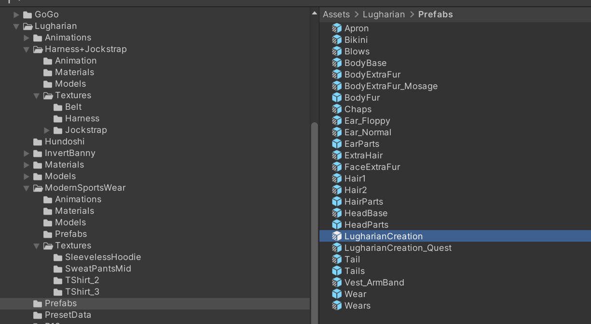
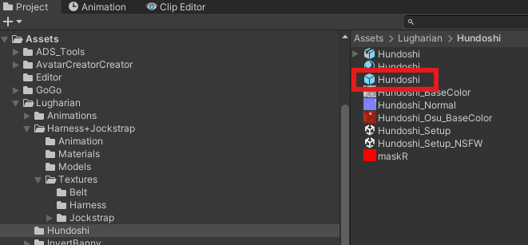
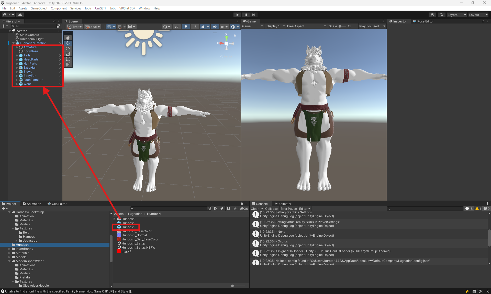

# Adding Compatible Parts to Lugharian Avatars

This guide provides detailed instructions on how to add compatible outfits and parts to the Lugharian avatar creator function.

## Overview

Lugharian avatars feature a unique avatar customization function called `AvatarCreator`. This function allows users to freely edit their avatar's appearance in Unity, similar to a game's character creator function.

## Base Object

The base prefab for Lugharian avatars is located at:

```
Assets/Lugharian/Prefabs/LugharianCreation.prefab
```

This prefab has the `Avatar Creator Setting` component attached, which manages the basic settings for the avatar creator function.



## Parts Objects

Lugharian avatar parts have the `Avatar Creator Parts Setting` component attached.

These components function by being placed under the base object.

## Basic Steps for Adding Parts

To add new parts to the Lugharian avatar creator function, follow these steps:

1. Expand `LugharianCreation.prefab` in the scene
2. Place the parts object under `LugharianCreation`

## Example of Adding Parts

Let's try adding a fundoshi (traditional Japanese underwear) outfit.

The fundoshi outfit prefab is located at:

```
Assets/Lugharian/Hundoshi/Hundoshi.prefab
```



1. Expand `LugharianCreation.prefab` in the scene
2. Place `Hundoshi.prefab` under `LugharianCreation`



3. It should look like the image below:


4. In this state, press the `Play` button to run the scene, and you can edit with the parts added.

:::info

If parts are not displayed correctly, please check the following:

- Whether the parts object is placed under `LugharianCreation.prefab`

:::
