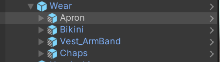
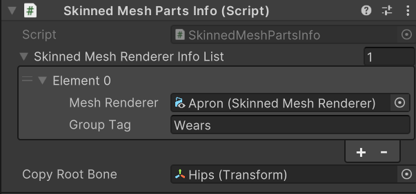
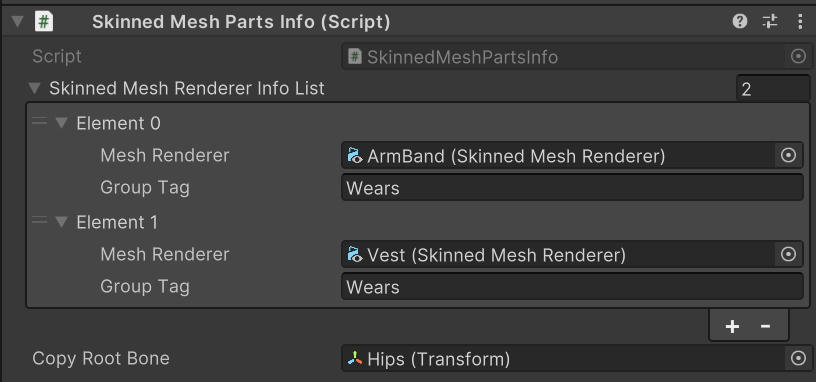

# Frequently Asked Questions

## Can you support clothing changes via Expression Menu?

The Lugharian avatar system does not support clothing changes via Expression Menu for the following reasons:

- To optimize avatar performance rank
- To keep avatar file size down, we prefer separate avatar uploads for each outfit
- Due to technical issues with the functionality to hide models under clothing

## I want to prevent some clothing parts from being merged when exported.

When implementing Expression Menu clothing changes yourself, there may be issues where some parts get merged together.

To solve this problem, you can separate parts by modifying the following location:

Example: Wears

Each part has a component called `Skinned Mesh Parts Info`, and items with the same name in `Group Tag` will be merged together.

For example, `Apron`, `Vest_ArmBand`, and `Chaps` have `Group Tag` set to `Wears` and will be merged.

By giving each `Group Tag` a different name, they will no longer be merged.
