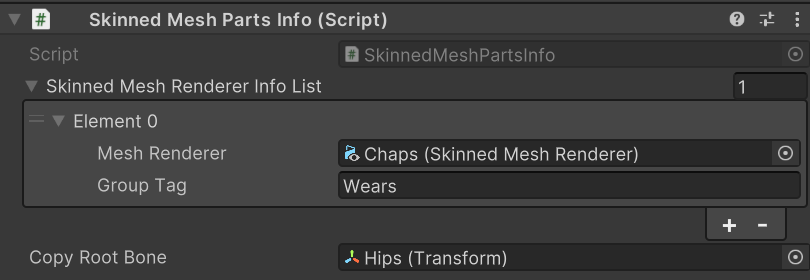
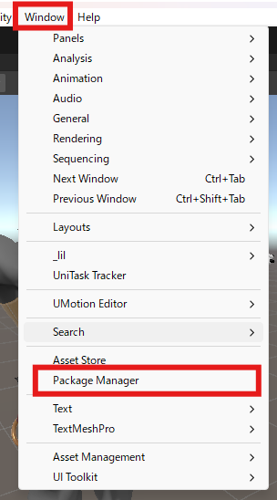

# Frequently Asked Questions

## Can you support clothing changes via Expression Menu?

The Lugharian avatar system does not support clothing changes via Expression Menu for the following reasons:

- To optimize avatar performance rank
- To keep avatar file size down, we prefer separate avatar uploads for each outfit
- Due to technical issues with the functionality to hide models under clothing

## I want to prevent some clothing parts from being merged when exported.

When implementing Expression Menu clothing changes yourself, there may be issues where some parts get merged together.

To solve this problem, you can separate parts by modifying the following location:

Example: Wears


Each part has a component called `Skinned Mesh Parts Info`, and items with the same name in `Group Tag` will be merged together.

For example, `Apron`, `Vest_ArmBand`, and `Chaps` have `Group Tag` set to `Wears` and will be merged.





By giving each `Group Tag` a different name, they will no longer be merged.

## I want to match body shape when modifying clothing etc. in Blender files

When adding clothing etc. with the included Blender files, if you want to match the changed body shape, you can change the body shape by modifying the shape keys (`defShape.Belly` etc.) of the `BodyBase` object.


:::info

In Lugharian, only the body shape change shape keys of BodyBase can be operated, and other shape keys with the same name are set to be the same as BodyBase's shape keys using Blender's driver function.

:::

## Export the exported avatar as a model file (GLB).

To export the exported avatar so it can be imported into other software like Resonite or Blender, you can export it in glTF file format (.glb).

First, add a package to export GLTF from Unity to your project.

Open `Window` > `Package Manager` from the toolbar.



Press the `+` button and select `Add package from git URL`.


Enter the following URL and add it:

```
https://github.com/vrm-c/UniVRM.git?path=/Assets/UniGLTF
```

If a `UniGLTF` item is added to the toolbar, the installation was successful.

To use it, select `Export glTF...` from `UniGLTF`.


Set the avatar you want to export to `Export Root`.


You can save it as a file by pressing `Export` without changing any settings.

To import into Blender, select `File` > `Import` > `glTF 2.0 (.glb/gltf)`.

Import with the following settings:


