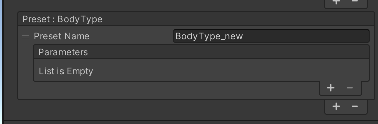
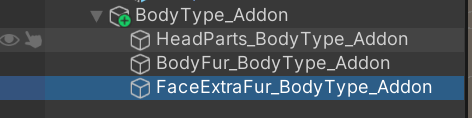

# Creating Preset Addons

## Overview

Preset addons are a feature that allows you to create addons that can add items to presets configured in `Avatar Creator Setting` or `Avatar Creator Parts Setting`.

This can be used when creating retextures that support color changes.

## Usage

This will be explained using the example of adding a new BodyType to the Lugharian tribe later.

First, create a new game object.

Next, add `Avatar Creator Preset Addon` to that game object.

In `Target Parts Name`, set the name of the part that has the preset parameter you want to combine with. For the base, you can leave it blank.

This time we want to add a new preset to the base `BodyType`, so we'll leave it as is.

`Preset Name` is the name of the preset to add to. Enter `BodyType`.

Next, add the shared parameters to be changed by the preset.
Press the plus button in `Shared Parameters` and add the `BodyBase_MaskTex` parameter just like the preset set in `LugharianCreation`, and set `Type` to `Texture`.

Items in the `BodyType` preset set in `LugharianCreation`

Add `BodyBase_MaskTex` to `Shared Parameters` and set `Type` to `Texture`

Then, press the plus button from the `Preset` item to create a new preset, and set the `Preset Name` to `BodyType_new` etc.

:::info

Please be careful to make the preset name unique at this time. If presets have the same name, they will not be reflected.

:::

Press the plus button in the `Parameters` list, change `Shared Parameter ID` to the `BodyBase_MaskTex` you set earlier, and set a new mask to `Texture`.

Place this game object once under the hierarchy of `LugharianCreation` (the object with `AvatarCreatorSetting` attached).

Let's try playing once in this state.

`BodyType_new` is added to `BodyType` and changes when selected.

`BodyType` is also used by other parts objects, so set those as well.

The applicable ones are `HeadParts`, `BodyFur`, and `FaceExtraFur`.

Create a new game object and place it under the addon object from earlier. The location can be anywhere, but if it's for the same preset parameter, making them parent-child relationships will be convenient when creating prefabs later. It's also good to give them appropriate names.

Make the following settings for the newly added `HeadParts_BodyType_Addon`. The `Target Parts Name` changes, and the target `Shared Parameters` also change.

Similarly, change `BodyFur` and `FaceExtraFur`.

`BodyFur` settings

`FaceExtraFur` settings

If it finally looks like this, it's OK.

When you run it again, it will look like this.

We were able to add `BodyType` later.
