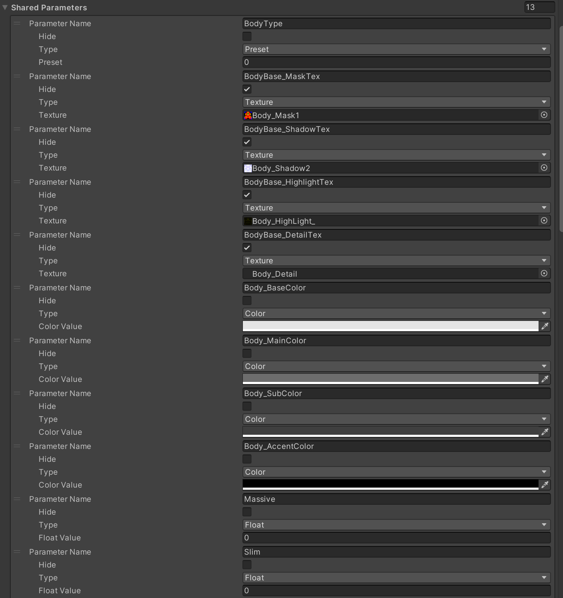

# About Avatar Creator Function

This explains the `Avatar Creator` system adopted in Lugharian avatars.

## Overview

`AvatarCreator` is a feature that allows you to implement avatar assembly functionality in Unity Editor for VRChat avatars, similar to a game's character creator function.

`AvatarCreator` provides the following avatar editing features:

- Color changing function by body parts (Custom Layered Texture)
- Mesh hiding function for skin etc. linked to parts display like clothing (Layered Alpha Texture)
- BlendShape adjustment and baking function during export
- Dynamic shader parameter changes
- Detailed parameter control using AnimationClip
- Setting presets
- Object merging and optimization during export

`AvatarCreator` has two types of components: `AvatarCreatorSetting` and `AvatarCreatorPartsSetting`, each with the following roles:

- **AvatarCreatorSetting**: A component that defines the base settings of the avatar. Attach it to the root object of the avatar.

- **AvatarCreatorPartsSetting**: A component that attaches to child objects of avatars with `AvatarCreatorSetting` applied and defines settings for additional parts (clothing, accessories, etc.).

When an avatar with `AvatarCreatorSetting` exists in the scene and Unity's play mode is started, `AvatarCreatorSetting` collects `AvatarCreatorPartsSetting` attached to itself and child objects, and builds character creator functionality based on those settings. This structure allows you to add customization items for clothing and parts in addon format without directly editing the base avatar settings.

## Skinned Mesh Renderer Combine Info

`Skinned Mesh Renderer Combine Info` is a function that combines several meshes according to `Group Tag` during output.
In `Avatar Creator Setting`, by registering meshes in `Skinned Mesh Renderer Combine Info List`, skinned meshes and materials are recognized in subsequent setting items.

In `Avatar Creator Parts Setting`, meshes are registered by setting a component called `Skinned Mesh Parts Info` in `Skinned Mesh Parts Info List`.
In `Skinned Mesh Parts Info`, set the object corresponding to the root bone in the base to `Copy Root Bone`.

If nothing is specified for `GroupTag`, skinned meshes are grouped together as one mesh with an object named `Body`.
Otherwise, they are combined with objects of the same name.

## Shared Parameters

Shared parameters represent parameters that users can change in the character creator function.

The following types exist:

- **Float**: Numerical value in the range 0 to 1. Used for blend shape weights, shader numerical parameters, etc.
- **Color**: Color information. Used for material colors, etc.
- **Texture**: Texture asset. Used for material texture slots, etc.
- **GameObjectToggle**: Toggles game object visibility on/off.
- **Preset**: Parameter for the preset function described later.

When a SharedParameter defined in `AvatarCreatorPartsSetting` has the same name and type as a SharedParameter in `AvatarCreatorSetting` (base settings), the one from `AvatarCreatorSetting` takes priority (essentially referencing the base setting's parameter). Only parameters that don't exist in `AvatarCreatorSetting` are treated as unique to `AvatarCreatorPartsSetting`. Parameters are not directly integrated or conflict-resolved between parts.

|Item|Description|
|---|---|
|Parameter Name|Parameter name|
|Hide|Whether to hide from users|
|Type|Parameter type|
|Value|Initial value according to parameter type|

## Layered Alpha Texture

Layered Alpha Texture is a function that dynamically generates alpha masks to hide meshes (such as skin) inside when specific parts (such as clothing) are displayed.

It works in conjunction with `GameObjectToggle` type shared parameters, and when the corresponding part is in a displayed state, it combines the specified alpha textures. For example, if there are multiple clothing parts and each has an alpha mask to hide skin, a final alpha mask texture is generated that combines only the alpha masks corresponding to the currently displayed clothing parts.
This generated Layered Alpha Texture can be set in the Alpha Mask slot of Custom Layered Texture to achieve the effect of preventing mesh penetration.

|Item|Description|
|---|---|
|Combined Texture ID|Target and alpha texture to be combined. Selected from shared parameters|
|Toggle Object ID|Combined when the `GameObjectToggle` parameter set here is enabled|
|Source Texture ID|Mask texture to combine. Selected from shared parameters|

## Custom Layered Texture
Custom Layered Texture is a function that achieves partial color changes of textures. It doesn't depend on shader functionality and generates color images directly at runtime, so it can be used in combination with various shaders.

The processing overview is as follows:
1. **BaseColor**: Set the base color.
2. **MaskTexture application**: Apply specified colors (MainColor, SubColor, AccentColor) to areas corresponding to R, G, B channels of the Mask texture.
3. **ShadowTexture composition**: Compose Shadow texture.
4. **HighlightTexture composition**: Compose Highlight texture using Screen or other methods.
5. **DetailTexture composition**: Compose Detail texture using multiplication or other methods.
6. **AlphaMaskTexture application**: (Optional) Apply alpha mask generated by Layered Alpha Texture function.

### ShadowTexture Composition Method
Shadow uses a special process where the brightness of HSV values is reduced by 50% according to the shadow texture values.
Using this composition method creates a mechanism where natural shadows can be created with only shadow masks while maintaining color consistency.

### Shadow Blend Function

Only `Shadow Texture` and `Highlight Texture` can handle composition values linearly interpolated between R and G channels using `Blend Param`. This function is intended for shadow and highlight changes due to body shape changes.

The generated Custom Layered Texture can be set to any texture slot of any material. This allows flexible realization of body color changes or partial color changes of clothing.

|Item|Description|
|---|---|
|Texture Name|Name of this `Custom Layered Texture` (please make it unique within the part)|
|Layer Mask Tex Param|Texture used as mask texture for color separation|
|Shadow Tex Param|Composition texture for shadows|
|Highlight Tex Param|Screen composition texture for highlights|
|Detail Tex Param|Alpha composition texture not affected by color separation mask|
|Alpha Mask TexParam|Mask texture that determines the alpha value of the image. Used to specify `Layered Alpha Texture` that becomes the target to disappear when wearing clothing etc.|
|Base Color Param|Color parameter for black parts in color separation mask|
|Main Color Param|Color parameter for R channel in color separation mask|
|Sub Color Param|Color parameter for G channel in color separation mask|
|Accent Color Param|Color parameter for B channel in color separation mask|
|Blend Param|Blend Float parameter for shadow blend function|
|Is Standard Multipy|Use normal multiplication composition without special composition processing of shadow texture|
|Resolution|Texture resolution (3 types: 512, 1024, 2048)|

`Custom Layered Texture` can be set to texture slots of specific materials in `Custom Layered Texture Slot List`

|Item|Description|
|---|---|
|Material|Material to set texture to|
|Shader Parameter|Shader parameter to set texture to|
|Custom Texture|`Custom Layered Texture` to set|

## Preset
The preset function is a function that can save the state of multiple shared parameters as one set and switch them all at once.
Preset switching is performed by changing the value of `Preset` type shared parameters. For example, in Lugharian, it's used to change BodyType masks.

|Item|Description|
|---|---|
|Shared Preset Parameter ID|Preset parameter to set|
|Preset Name|Name of preset item|
|Shared Parameter ID|Shared parameter to change|

## Custom Shader Parameter
Custom Shader Parameter is a function that applies values of shared parameters (Float, Color, Texture types) to specific shader parameters of specified materials in real time.
This allows dynamic control of various values exposed by shaders from the character creator screen.

|Item|Description|
|---|---|
|Shader Parameter Name|Shader parameter to change|
|Shared Parameter ID|Shared parameter|
|Material ID|Material ID to change|

## BlendShape Parameter
BlendShapeParameter is a function that controls blend shape weights using shared parameters (Float type).

In AvatarCreator, special processing is performed on blend shapes with specific prefixes during avatar export processing (such as mesh merging):
- **`defShape.`**: Blend shapes with this prefix have deformations baked into the mesh based on export settings, and the blend shapes themselves are removed from the post-export mesh.
- **`eyeDef.`**: Similarly, deformations are baked into the mesh and blend shapes are removed. However, `eyeDef.` deformations are applied so as not to affect the deformation results of other facial expression blend shapes with prefixes like `eye.` `eye.l.` `eye.r.`. This is a mechanism to prevent other facial expression blend shapes (e.g., smile, angry face) from breaking when default expressions (e.g., half-closed eyes) are created with `eyeDef.` and baked.
- **`eye.` `eye.l.` `eye.r.`**: These prefixes are removed from blend shape names during mesh export.

These blend shape-related processes are mainly based on the specifications of mesh merging processing performed during avatar export.

|Item|Description|
|---|---|
|Shared Parameter ID|Shared parameter|
|Skinned Mesh ID|Skinned mesh with shape keys|
|Blend Shape ID|Blend shape to change|

## Animation Clip Parameter
AnimationClipParameter is a function that maps shared parameter (Float type) values to animation clip playback time and applies the animation results at that point to the avatar.
Using AnimationClip allows you to achieve more complex, non-linear changes (object transform changes, component property changes, etc.) that cannot be set with CustomShaderParameter or BlendShapeParameter. The Float value (0-1) of the shared parameter corresponds to the normalized time (0-1) of the AnimationClip.

|Item|Description|
|---|---|
|Shared Parameter ID|Shared parameter|
|Root Object|Root hierarchy object for animation|
|Clip|Animation clip|
