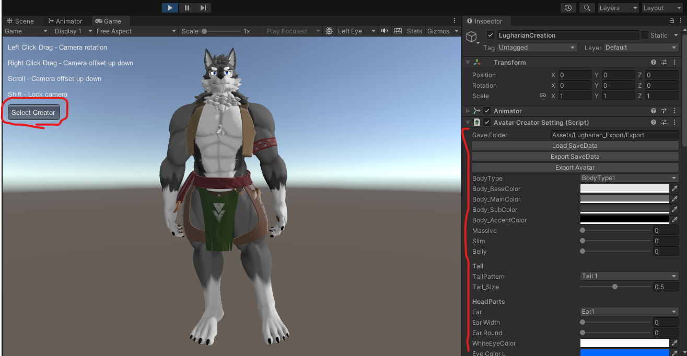
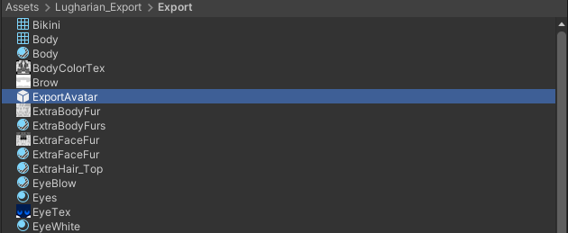
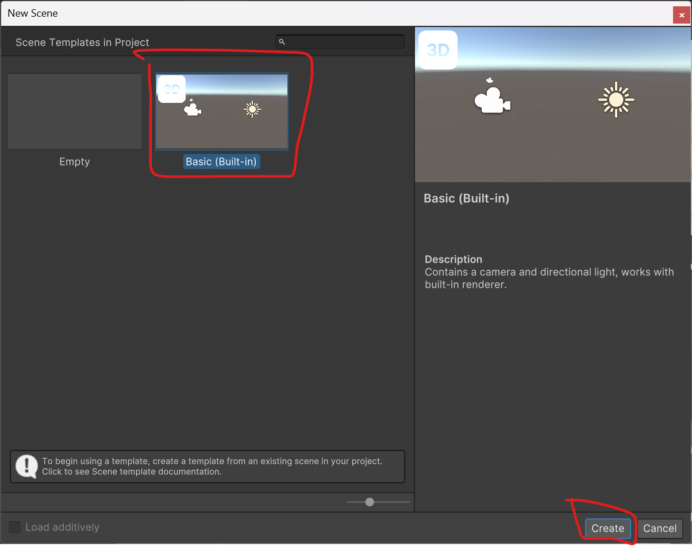

# Usage Guide

import useDocusaurusContext from '@docusaurus/useDocusaurusContext';

export const VersionInfo = () => {
  const {siteConfig} = useDocusaurusContext();
  return {siteConfig.customFields.version};
};

This guide assumes you have completed creating a Unity project for avatars using VCC.

## Video Tutorial

<iframe 
  width="560" 
  height="315" 
  src="https://www.youtube.com/embed/d0EHjJmXfDI" 
  title="YouTube video player" 
  frameborder="0" 
  allow="accelerometer; autoplay; clipboard-write; encrypted-media; gyroscope; picture-in-picture" 
  allowfullscreen
></iframe>

## Importing lilToon Shader

[lilToon](https://lilxyzw.github.io/lilToon/)

Import lilToon into your project by referring to the above site.

## Installing Modular Avatar

[Modular Avatar](https://modular-avatar.nadena.dev/)

Import Modular Avatar by referring to the above site.

## Importing This Package

Import Lugharian_v<VersionInfo />.unitypackage by dragging and dropping it into Unity.

## Starting the Avatar Creator Function

Open the Avatar scene located under the Lugharian folder.

Once the scene is open, press the Play button.

When the scene runs, the game view will switch and the Avatar Creator system will start.

## Customizing Your Character

Upon startup, you'll see a screen like the following. Press the `Select Creator` button in the game view to display character parameters.

:::info

If `Select Creator` is not displayed
Please set this slider in the GameView to 1x.

:::

## Item Descriptions

|Item Name|Description|
|---|---|
|Save Folder|The destination folder for saving customized avatars. Please specify a path starting with "Assets". Non-existing folders will be created automatically.|
|Load SaveData|Load avatar editing information from a file.|
|Export SaveData|Export avatar editing information to a file.|
|Export Avatar|Export the avatar with current settings.|

### Items Below

The items below are avatar customization parameters. Use sliders and color selections to customize to your liking.

## Uploading the Exported Avatar
When you press the `Export Avatar` button, a prefab called `ExportAvatar` will be generated in the specified folder.

Create a **new scene** and place `ExportAvatar` in the scene.

:::info

Operating in the Avatar scene may cause issues, so uploading in a separate scene is recommended.

:::

You can create a new scene by going to `File` > `New Scene`.

Select the `Basic(Built-in)` template and press `Create`.

Place the avatar in the scene and upload using your usual procedure.

:::tip

When you export an avatar, a `save.json` file is created in the export destination folder, which allows you to restore previous editing content using `Load SaveData` the next time you run the creator function.

:::

## Want to Make Your Avatar Public?

This avatar can be made Public on VRChat under the following conditions:

- Add the included shop information gimmick
- Contact the creator (@kurotori4423) with the Blueprint ID of the avatar you want to make Public.

The shop information gimmick is a prefab called `OpenShopInfo` located under the `Lugharian` folder, which should be added to the avatar you want to upload.

