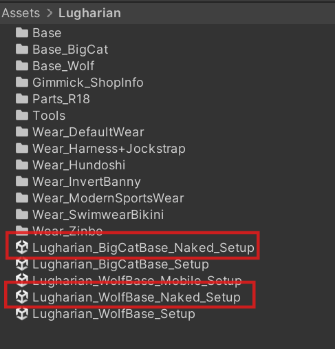
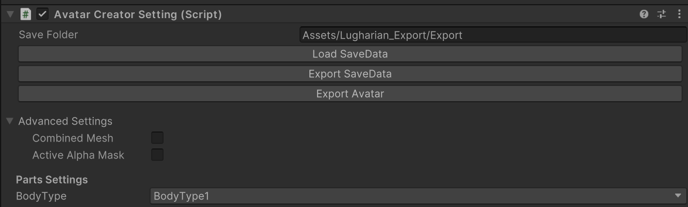
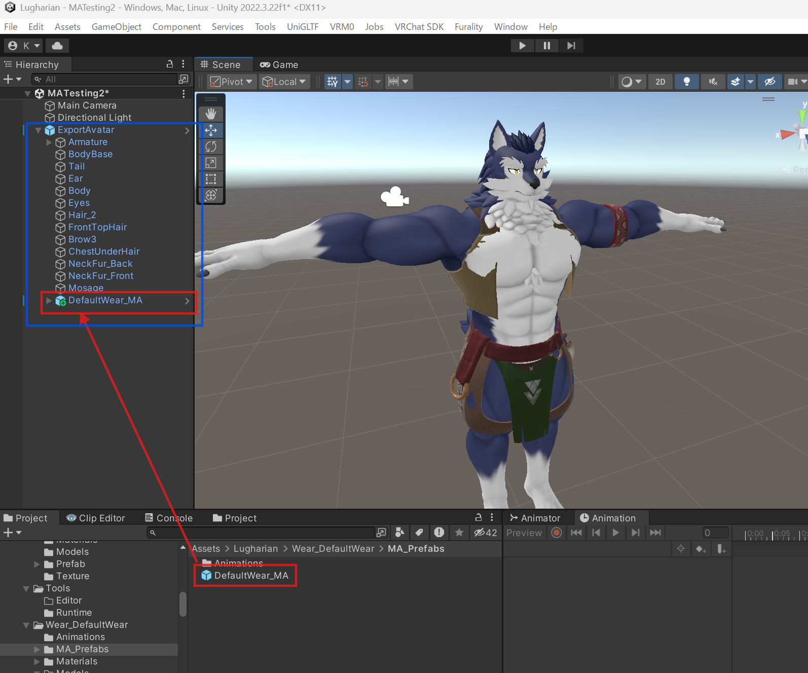

# Advanced Outfit and Accessory Setup with Modular Avatar

This guide is intended for intermediate to advanced avatar customizers who want to go beyond the avatar creation feature, including texture modification and implementing toggles and other on/off functions.

Starting from `v1.7`, Lugharian supports non-destructive outfit and accessory addition via [Modular Avatar](https://modular-avatar.nadena.dev/). Even if you have already exported a Lugharian base avatar and applied further texture edits or other modifications, you can now add or change outfits afterward.

It also includes automatic menu integration, so outfit toggles and adjustments can be switched in-game from the Expression menu.

## Create a Modular Avatar-compatible base

Use the steps below to create a dedicated base for Modular Avatar. Once this base is created, you can continue to apply your own textures and materials while freely changing into future outfits.

Open `Lugharian_○○Base_Naked_Setup` under `Assets/Lugharian/`.

Play the scene and enter Avatar Create.

In `Advanced Settings`, turn both of the following **off**:

- Combined Mesh
- Active Alpha Mask

After disabling them, create the base character and export the avatar with `Export Avatar`.

Place the exported avatar into any scene you like.

You can then use this base to apply your own textures and materials.

## Put an outfit on the created base

To dress the base you created here, place the prefab from the `MA_Prefabs` folder included in each outfit folder into the scene.

For example, in `Assets/Lugharian/Wear_DefaultWear`, add `DefaultWear_MA` from `MA_Prefabs` under the avatar hierarchy in the scene.

If the outfit does not match the body proportions, find the `Auto Body Adjuster Root` or `Auto Body Adjuster` component on the outfit prefab and run `Auto Adjust`.

Once you run it, the outfit blend shapes are adjusted automatically to match the body shape.

At this point the outfit has been set up successfully, and you can upload the avatar as-is.

## Notes for NSFW parts

Be careful when creating a base that uses the NSFW parts set.

For details, read [NSFW Parts Set Guide](parts/nsfw_partsset.md#notes-when-creating-an-ma-compatible-base-v17-and-later).

## Converting avatar prefabs exported before v1.7 into a compatible base

If you have avatar prefabs exported before `v1.7`, and they were exported using the options described above, you can make them compatible with `Auto Body Adjuster` through the following additional step.

Add a component called `BodyInfo` to the root object of the prefab. This component stores the body shape information for a Lugharian avatar. Simply assign the generated `save.json` file to `Body Parameter Json`, and `Auto Body Adjuster` will be able to automatically match the body proportions.

## Standard MA prefab reference

### Lugharian/Base/MA_Prefabs/MA_BodyFur

Adds a menu for turning fur on and off for each body part.