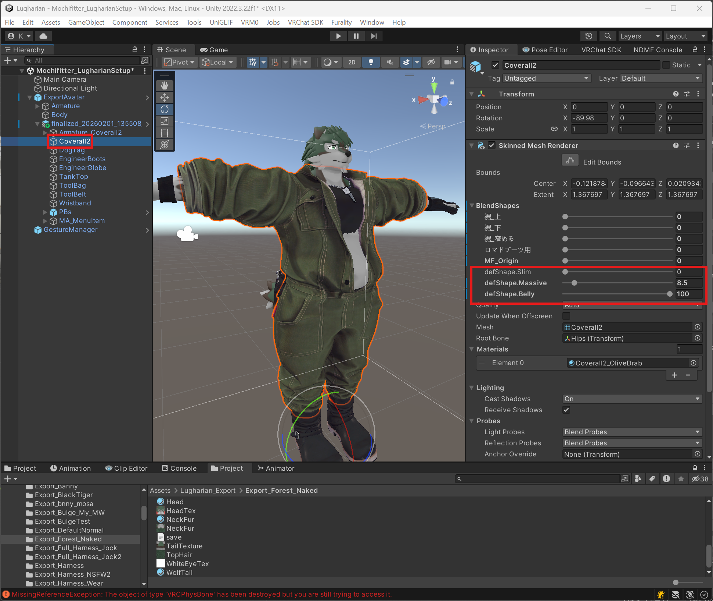
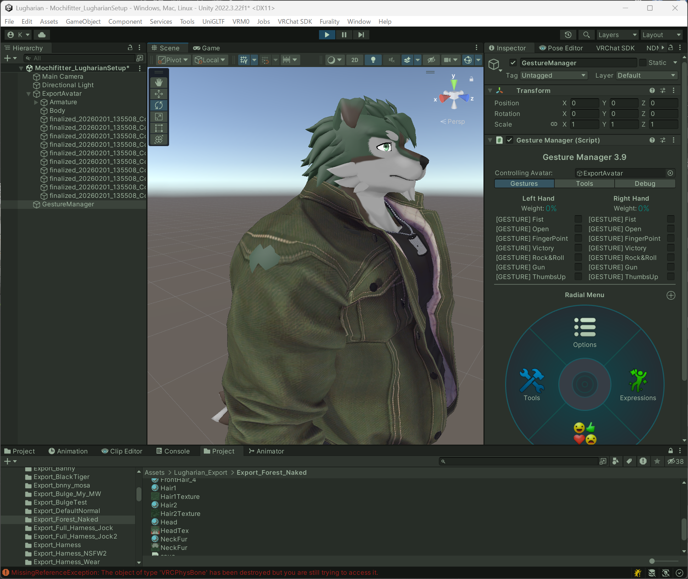
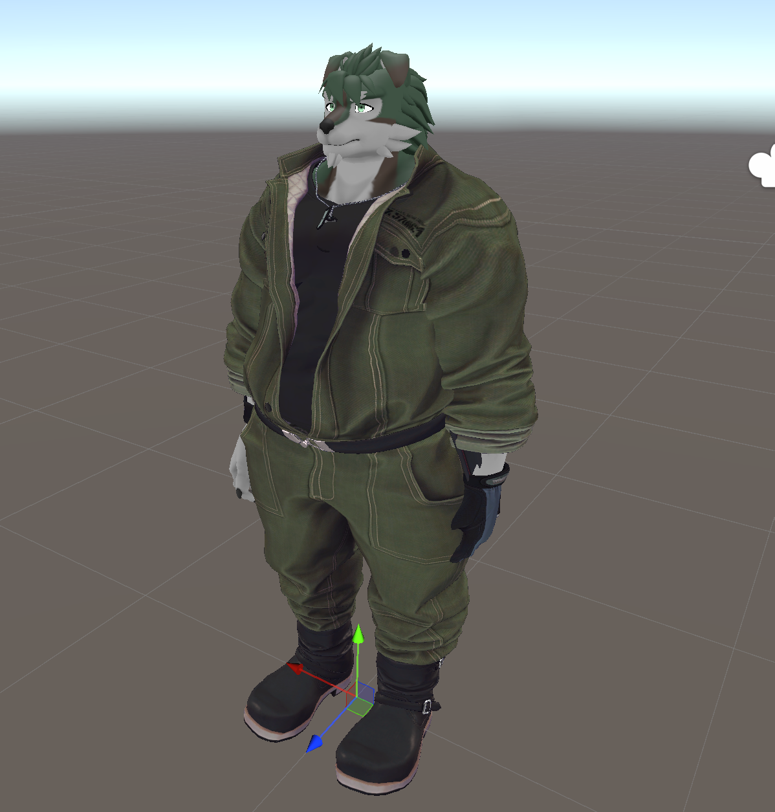

# Setting up unsupported outfits with Mochifitter

By using the Lugharian Mochifitter profile, you can use [Mochifitter](https://yamirin.booth.pm/items/7657840) to dress Lugharian in outfits that are not officially supported (this assumes that a reverse-conversion profile for the outfit exists).

## Notes

The current profile (v0.1) has the following known issues:

- The mesh around the shoulders and chest is prone to clipping/intersection.
- Gloves and similar items may not convert correctly.

It is not yet clear whether these issues come from the Lugharian avatar itself or from Mochifitter, so perfect conversion is not guaranteed. Please treat this as a rough conversion.

## How to use

For detailed usage, refer to the Mochifitter documentation.

### 1. Import required packages

Import the following packages into your Unity project:

- Lugharian (base avatar)
- Mochifitter
- Lugharian Mochifitter profile
- The outfit package you want to convert
- A Mochifitter reverse (backward) profile for that outfit

### 2. Convert the outfit

In this example, we explain the workflow using [TinmeshiTei Common Base Body “Engineer Coveralls”](https://booth.pm/ja/items/6030643). The reverse-conversion profile can be obtained [here](https://booth.pm/ja/items/7664825).

Additionally, make sure you have already imported these packages into the project via `VCC` or `ALCOM`:

- [Modular Avatar](https://modular-avatar.nadena.dev/)
- [AAO: Avatar Optimizer](https://vpm.anatawa12.com/avatar-optimizer/)

From the toolbar, select `Tools` > `Mochifitter` to open the `MochiFitter` window.

**On the first run, you will be prompted to install Blender and the add-on. Please install them.**

After installation is complete, set the outfit you want to convert in `Outfit to Convert`. In this example, we set:

`Assets/TinmeshiTei/Cloths/Coverall2/Prefab/Coverall2_ClothOffGimmic.prefab`

Then select:

- `変換先アバター / Target Avatar`: `Lugharian`
- `衣装元アバター / Source Avatar`: `TinmeshiTeiBody`

`衣装元アバター / Source Avatar` depends on which avatar the outfit was made for.

Without changing other settings, run `Execute Retargeting`.

After a short while, the outfit conversion will complete.

### 3. Put the outfit on

First, place the Lugharian `ExportAvatar` prefab you want to dress into the scene. It is helpful to prepare a Lugharian avatar that has no clothes equipped.

Next, drag and drop the converted outfit prefab so it becomes a direct child of the avatar in the scene hierarchy.

If you have changed Lugharian's body proportions, you will need some adjustments.

Open the exported Lugharian `save.json`.

In the JSON file, find the `Massive`, `Slim`, and `Belly` entries, then note the values of their `floatParameter`.

In this avatar example:

- Massive: 0.085
- Slim: 0.0
- Belly: 1.0

Then multiply these values by **100**, and set them on each outfit mesh under `BlendShapes` as `defShape.Massive`, `defShape.Slim`, and `defShape.Belly`.

- `defShape.Massive`: 8.5
- `defShape.Slim`: 0
- `defShape.Belly`: 100

When everything is set, it should look like this:

At this point, equipping the outfit is complete.

## 4. (Optional) Fix clipping/intersection

Figure 1: When lowering the arms, the base body intersects around the shoulders.

Figure 2: Fingers are misaligned relative to the gloves.

Depending on the outfit (and due to the v0.1 known issues), you may encounter clipping/intersection problems. This section explains a simple way to address them.

Here, we demonstrate removing the intersecting part of the base body mesh using the `AAO` feature `AAO Remove Mesh By Box`.

Select the `Body` mesh, then use `Add Component` and choose `AAO Remove Mesh By Box`.

Select `Edit This Box`, then move the box to cover the shoulder area you want to remove.

Press the `+` button to add a box, then flip the X axis to remove the opposite side as well.

Similarly, remove any other unnecessary mesh areas.

The clipping/intersection can now be fixed.

